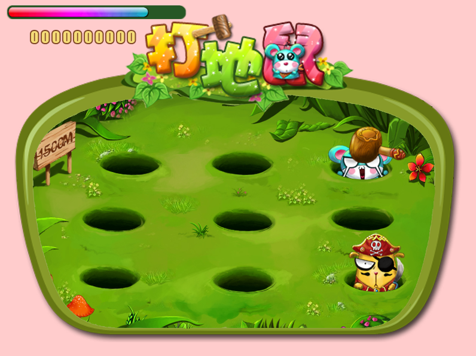

Whack-a-mole copy is an interesting leisure. Imitating the familiar whack-a-mole game, used by 2 to 4 players cooperation skills to eliminate its burrow shrews, corresponding color players to kill the corresponding color of rat, the score of the final settlement. 